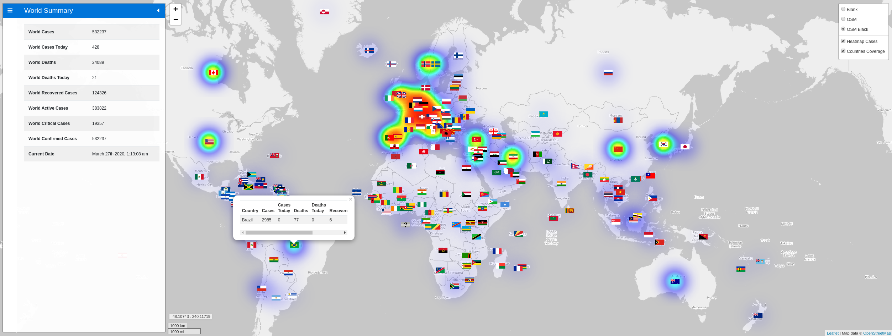

# Corona Virus Tracker CLI

Thanks to: https://github.com/sagarkarira
    
Application: https://github.com/sagarkarira/coronavirus-tracker-cli
    
# Access the map visualizer

https://jether2011.github.io/covid19-map-visualizer/

# Data Sources

* Source 1 : [John Hopkins Data API](https://github.com/ExpDev07/coronavirus-tracker-api)
* Source 2 : [WorldoMeters Data API](https://github.com/NovelCOVID/API/) updated very frequently.

**Note: Source 2 is the default source now if not mentioned**

# Screenshot

